# Chart Types and Parameter Reference

## Example datasets used in this topic

This topic uses the following open source datasets as examples:

- New York taxi data. The following figure shows the details of the data table:

  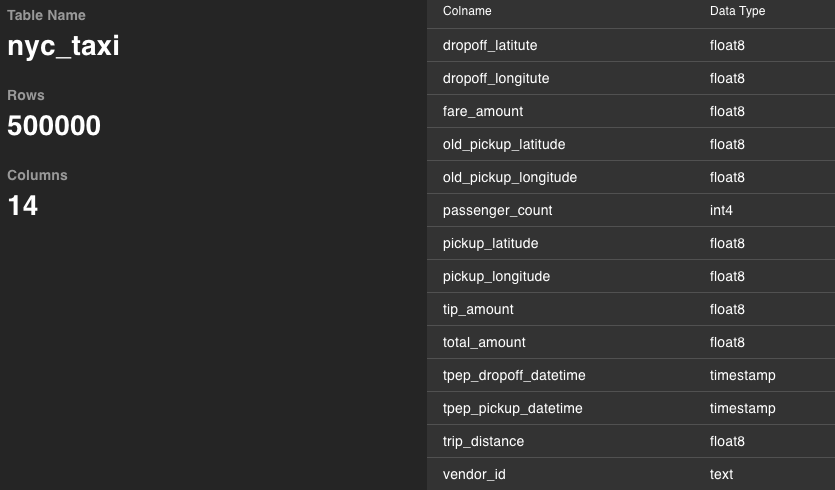

- Shanghai WiFi base station data. The following figure shows the details of the data table:

  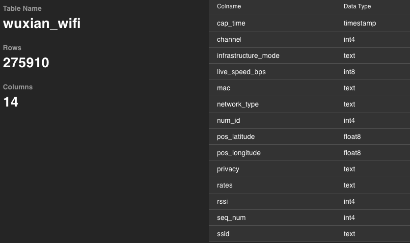

## Number chart

In a number chart, you can use various measurement methods and data formats for numerics. The following chart uses the New York taxi dataset to display the average fare amount. Refer to [Example datasets used in this topic](#Example-datasets-used-in-this-topic) for more information.

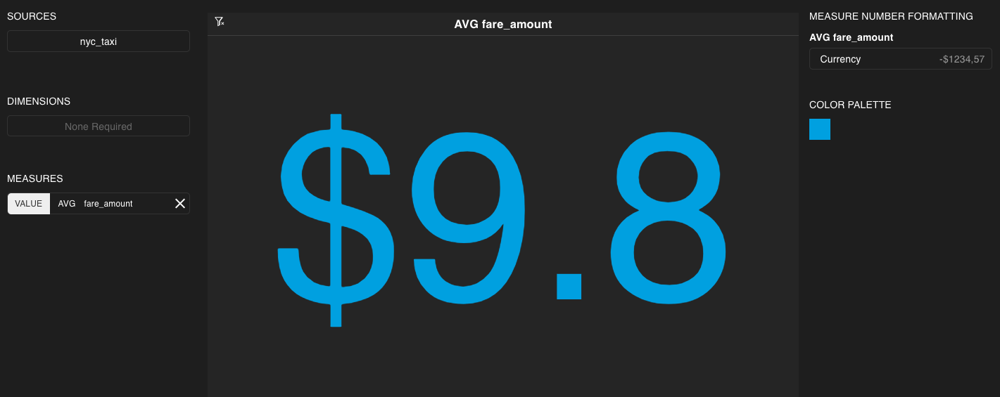

The following table displays the parameters of a number chart:

| Parameter| Description |
|------|--------------|
|`SOURCES`  |   Table name in the database and used as the data source of the chart.  This parameter is required.   |
|`DIMENSIONS`   |   This parameter is not available for number charts.    |
|`MEASURES`    |   Measure field for the chart. Specifies how to perform calculations on the data and includes the following parameter: <ul><li>`VALUE`：The numeric value displayed in the chart. This parameter is required.</li></ul>You can use built-in functions or customized expressions with SQL functions. Refer to [Functions and Operators](./megawise_func_op) for supported SQL functions. An example of customized expression is `avg(tip_amount/total_amount)`.              |
|`MEASURE NUMBER FORMATTING` |  Display format of measure data in the chart. |
|`COLOR PALETTE`    |    Color of the number.            |

You cannot set filters for number charts.

## Line chart

In a line chart, you can analyze the track of data in a specific range. You also can perform correlation analysis for multiple types of data. The following chart uses the New York taxi dataset to display the track of the average tip value across different time ranges. Refer to [Example datasets used in this topic](#Example-datasets-used-in-this-topic) for more information.

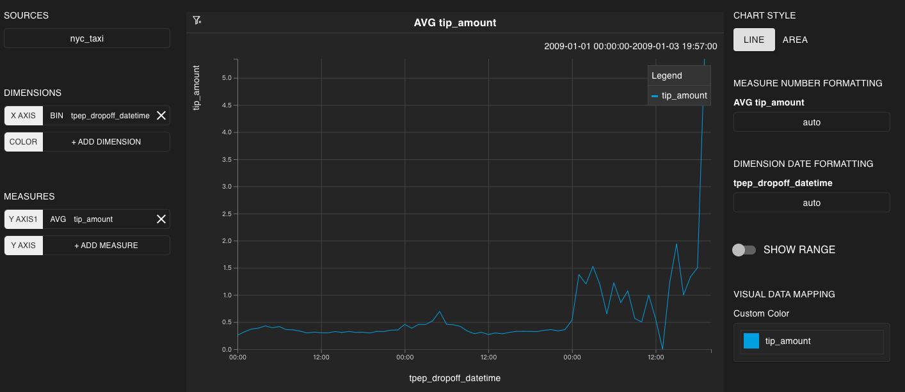

The following table displays parameters of a line chart:

| Parameter| Description |
|------|--------------|
|`SOURCES`  |   Table name in the database and used as the data source of the chart. This parameter is required.    |
|`DIMENSIONS`    |   Dimension field for the chart. Specifies how to group data and includes the following parameters: <ul><li>`X AXIS`: Data of the X AXIS. This parameter is required.</li><li>`COLOR`: Color group of the lines.</li></ul> You can use column numbers of the data table or customized SQL queries as the parameter value. Refer to [Basic Data Operations](./megawise_basic_operation) for supported SQL syntax. An example of customized expression is `tip_amount/total_amount`.    |
|`MEASURES`    |   Measure field for a chart. Specifies how to perform calculation on the data and includes the following parameters: <ul><li>`Y AXIS`: Data of the Y AXIS. This parameter is required. You can add multiple lines. If you specify value for `COLOR`, you cannot add multiple `Y AXIS` parameters.</li></ul>  You can use built-in functions or customize SQL functions. Refer to [Functions and Operators](./megawise_func_op) for supported SQL functions. An example of customized expression is `avg(tip_amount/total_amount)`.           |
|`CHART STYLE` |   Can be line chat or area chart. The following figure shows an area chart:     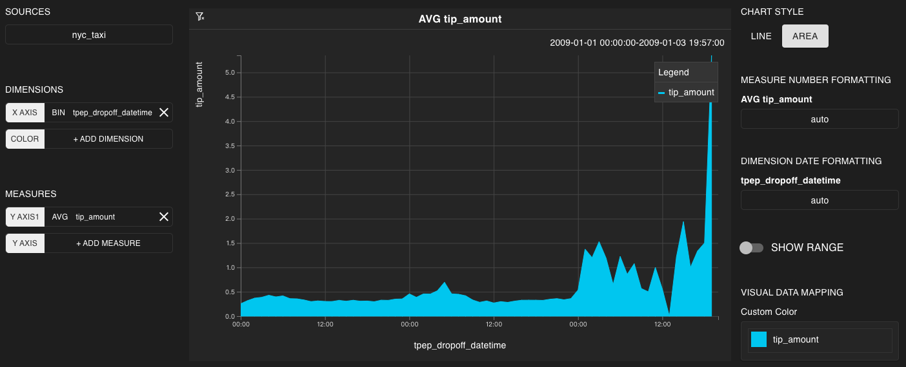    |
|`MEASURE NUMBER FORMATTING` |  Display format of measure data in the chart.|
|`DIMENSION FORMATTING` |  Display format of dimension data in the chart. |
|`SHOW RANGE`     | When TRUE, the whole line chart is displayed at the bottom. Use the mouse to drag an area in order to exclusively measure the data in the area.    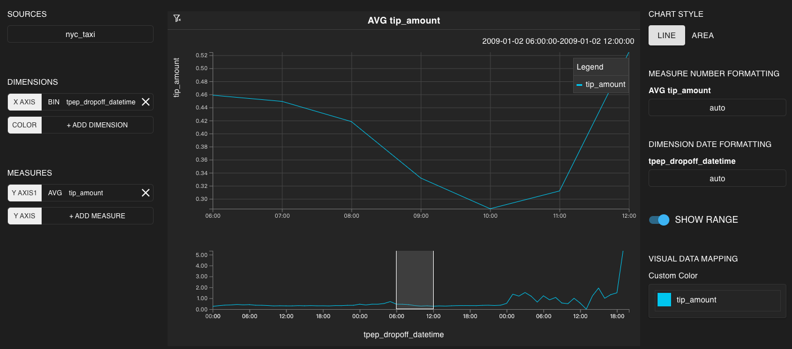    |
|`VISUAL DATA MAPPING`   |    Customizes the color of lines.         |

> Note: For charts with `DIMENSIONS`, you must use and only use [aggregate functions](./megawise_func_op) for customized expressions in `MEASURES`.

Use the mouse to drag an area to add the data represented by the area to the filter.

To automatically play the line chart, drag an area and click the triangular display button. This is equivalent to a moving filter and causes real-time changes to other related charts in the dashboard.

  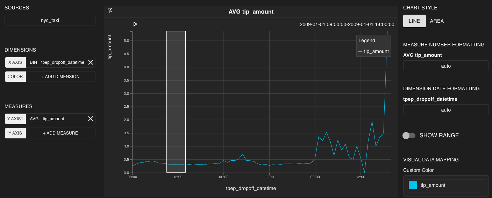

## Pie chart

In a pie chart, you can analyze the proportion of different components. The following chart uses New York taxi dataset to display the proportion of trip numbers of different vendors. Refer to [Example datasets used in this topic](#Example-datasets-used-in-this-topic) for more information.

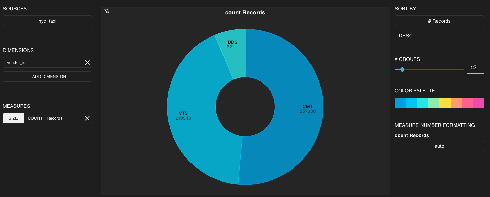

The following table displays parameters of a pie chart:

| Parameter| Description |
|------|--------------|
|`SOURCES`  |   Table name in the database and used as the data source of the chart. This parameter is required.   |
|`DIMENSIONS`    |   Dimension field for the chart. Specifies how to group data. You can use column numbers of the data table or customized SQL queries as the parameter value. Refer to [Basic Data Operations](./megawise_basic_operation) for supported SQL syntax. This parameter is required. An example of customized expression is `tip_amount/total_amount`.    |
|`MEASURES`    |   Measure field for a chart. Specifies how to perform calculation on the data and includes the following parameters: <ul><li>`SIZE`: Size of the arc. This parameter is required.</li></ul>     You can use built-in functions or customize SQL functions. Refer to [Functions and Operators](./megawise_func_op) for supported SQL functions. An example of customized expression is `avg(tip_amount/total_amount)`.          |
|`SORT BY`    |        Column name and sort order. Used to sort the chart. |  
|`# GROUPS`     |   Maximum number of groups.    |
|`COLOR PALETTE`      |   Color range of the pie chart.      |
|`MEASURE NUMBER FORMATTING` |  Display format of measure data in the chart.|

> Note: For charts with `DIMENSIONS`, you must use and only use [aggregate functions](./megawise_func_op) for customized expressions in `MEASURES`.

Click any arc in the chart. If the arc becomes highlighted, you can assume that the data represented by the arc is added to the filter.

## Bar chart

In a bar chart, you can analyze specific types of data under certain conditions. The following chart uses New York taxi dataset to display the average passenger number in different hours. Refer to [Example datasets used in this topic](#Example-datasets-used-in-this-topic) for more information.

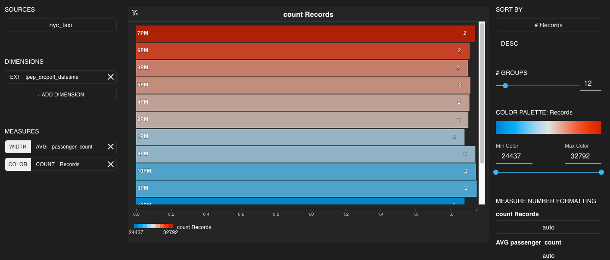

The following table displays parameters of a bar chart:

| Parameter| Description |
|------|--------------|
|`SOURCES`  |   Table name in the database and used as the data source of the chart. This parameter is required.   |
|`DIMENSIONS`    |   Dimension field for the chart. Specifies how to group data. You can use column numbers of the data table or customized SQL queries as the parameter value. Refer to [Basic Data Operations](./megawise_basic_operation) for supported SQL syntax. This parameter is required. An example of customized expression is `tip_amount/total_amount`.     |
|`MEASURES`    |   Measure field for a chart. Specifies how to perform calculation on the data and includes the following parameters: <ul><li>`WIDTH`: Width of the bars. This parameter is required.</li><li>`COLOR`: Color of the bars.</li></ul>   You can use built-in functions or customize SQL functions. Refer to [Functions and Operators](./megawise_func_op) for supported SQL functions. An example of customized expression is `avg(tip_amount/total_amount)`.         |
|`SORT BY`    |    Column name and sort order. Used to sort the chart.  |  
|`# GROUPS`     |   Maximum number of groups.     |
|`COLOR PALETTE`    |      Color range of the bars.          |
|`MEASURE NUMBER FORMATTING` |  Display format of measure data in the chart.|

> Note: For charts with `DIMENSIONS`, you must use and only use [aggregate functions](./megawise_func_op) for customized expressions in `MEASURES`.

Click a bar in the chart. If the chart becomes highlighted, you can assume that the data represented by the bar is added to the filter.

## Stacked bar chart

In a stacked bar chart, you can stack the bars of multiple data types in order to analyze the correlation between data types and their sub-types. The following chart uses the Shanghai WiFi base station dataset to display the SSID sub-types in each WiFi network type. Refer to [Example datasets used in this topic](#Example-datasets-used-in-this-topic) for more information.

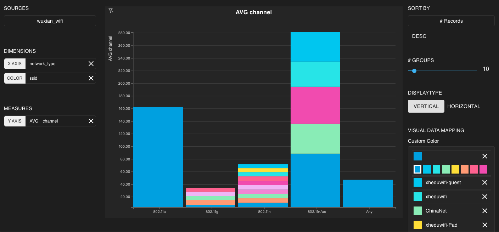

The following table displays parameters of a stacked bar chart:

| Parameter| Description |
|------|--------------|
|`SOURCES`  |   Table name in the database and used as the data source of the chart. This parameter is required.   |
|`DIMENSIONS`   |   Dimension field for the chart. Specifies how to group data and includes the following parameters:<ul><li>`X AXIS`: Group of each bar. This parameter is required.</li><li>`COLOR`: Color group of each bar.</li></ul> You can use column numbers of the data table or customized SQL queries as the parameter value. Refer to [Basic Data Operations](./megawise_basic_operation) for supported SQL syntax. An example of customized expression is `tip_amount/total_amount`.   |
|`MEASURES`    |   Measure field for a chart. Specifies how to perform calculation on the data and includes the following parameters: <ul><li>`Y AXIS`: Length of each bar. This parameter is required.</li></ul>   You can use built-in functions or customize SQL functions. Refer to [Functions and Operators](./megawise_func_op) for supported SQL functions. An example of customized expression is `avg(tip_amount/total_amount)`.   |
|`SORT BY`    |        Column name and sort order. Used to sort the chart.   |  
|`# GROUPS`     |   Maximum number of groups.     |
|`DISPLAY TYPE` | Can be vertical or horizontal.      |
|`VISUAL DATA MAPPING`    |      Color range of the bars. You can add or remove columns. |

> Note: For charts with `DIMENSIONS`, you must use and only use [aggregate functions](./megawise_func_op) for customized expressions in `MEASURES`.

Click a bar in the chart. If the chart becomes highlighted, you can assume that the data represented by the bar is added to the filter.

## Histogram

In a histogram, you can analyze specific types of data under certain conditions. Different from the bar chart or stacked bar chart. The following chart uses New York taxi dataset to display the average passenger number in different hours. Each bar is divided into different colored components based on vendor IDs. Refer to [Example datasets used in this topic](#Example-datasets-used-in-this-topic) for more information.

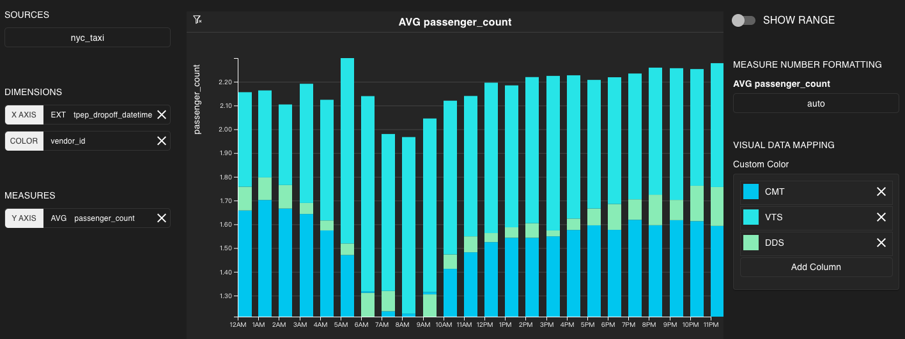

| Parameter | Description |
|------|--------------|
|`SOURCES`  |  Table name in the database and used as the data source of the chart. This parameter is required.    |
|`DIMENSIONS`   |  Dimension field for the chart. Specifies how to group data and includes the following parameters: <ul><li>`X AXIS`: Group of each bar. This parameter is required.</li><li>`COLOR`: Color group in each bar.</li></ul> You can use column numbers of the data table or customized SQL queries as the parameter value. Refer to [Basic Data Operations](./megawise_basic_operation) for supported SQL syntax. An example of customized expression is `tip_amount/total_amount`.  |
|`MEASURES`    |   Measure field for a chart. Specifies how to perform calculation on the data and includes the following parameters: <ul><li>`Y AXIS`: Height of each bar. This parameter is required.</li></ul>   You can use built-in functions or customize SQL functions. Refer to [Functions and Operators](./megawise_func_op) for supported SQL functions. An example of customized expression is `avg(tip_amount/total_amount)`.   | 
|`MEASURE NUMBER FORMATTING` | Data format of the `MEASURE` parameter.     |
|`VISUAL DATA MAPPING`    |   Color group in each bar. Corresponds to the `COLOR` parameter in `MEASURES`. You can add or remove columns.   |

> Note: For charts with `DIMENSIONS`, you must use and only use [aggregate functions](./megawise_func_op) for customized expressions in `MEASURES`.

Use the mouse to drag an area to add the data represented by the area to the filter.

> Note: The filter in a histogram is continuous. When a bar is highlighted, it does not mean that all related data is added to the filter. The filter is based on the X AXIS.

## Table chart

In a table chart, you can group data based on columns in order to analyze data. The following chart uses the New York taxi dataset to display the maximum tip amount and the number of records. Refer to [Example datasets used in this topic](#Example-datasets-used-in-this-topic) for more information.

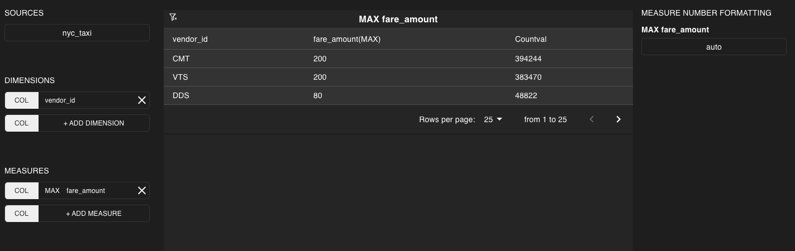

The following table displays parameters of a table chart:

| Parameter| Description |
|------|--------------|
|`SOURCES`  |   Table name in the database and used as the data source of the chart. This parameter is required.   |
|`DIMENSIONS`    |   Dimension field for the chart. Specifies how to group data and includes the following parameters:<ul><li>`COL`: Used to generate columns in the data chart. You can add multiple columns. If you do not add any column in `MEASURES`, then this parameter is required.</li></ul>   You can use column numbers of the data table or customized SQL queries as the parameter value. Refer to [Basic Data Operations](./megawise_basic_operation) for supported SQL syntax. An example of customized expression is `tip_amount/total_amount`.  |
|`MEASURES`    |   Measure field for a chart. Specifies how to perform calculation on the data and includes the following parameters: <ul><li>`COL`: Used to generate columns in the data chart. You can add multiple columns. If you do not add any column in `DIMENSIONS`, then this parameter is required.</li></ul>   You can use built-in functions or customize SQL functions. Refer to [Functions and Operators](./megawise_func_op) for supported SQL functions. An example of customized expression is `avg(tip_amount/total_amount)`.   |
|`MEASURE NUMBER FORMATTING` |  Display format of measure data in the chart.|
|`DIMENSION FORMATTING` |  Display format of dimension data in the chart.|

> Note: For charts with `DIMENSIONS`, you must use and only use [aggregate functions](./megawise_func_op) for customized expressions in `MEASURES`.

Click a cell in the table chart. If the cell becomes highlighted, you can assume that the data in the cell is added to the filter.

## Heat chart

In a heat chart, you can analyze data changes based on the color of different cells. The following chart uses New York tax dataset. The X AXIS and the Y AXIS represent date and time, respectively. The color of each cell is determined by the average passenger count in a specific time and date. The closer the color is to the maximum color, the higher the average passenger count. Refer to [Example datasets used in this topic](#Example-datasets-used-in-this-topic) for more information.

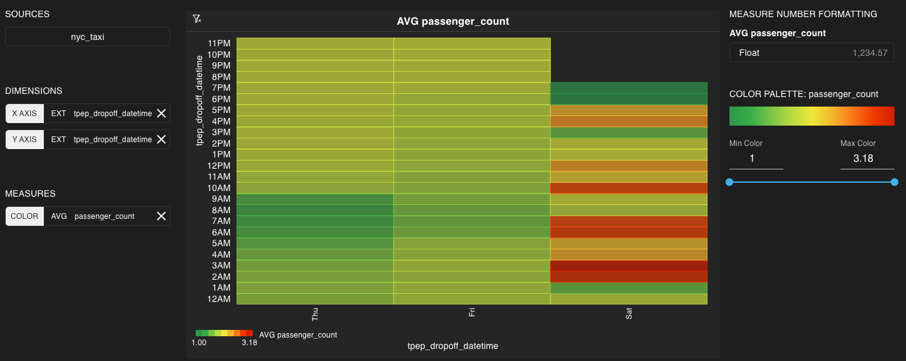

The following table displays parameters of a heat chart:

| Parameter| Description |
|------|--------------|
|`SOURCES`  |   Table name in the database and used as the data source of the chart. This parameter is required.   |
|`DIMENSIONS`    |   Dimension field for the chart. Specifies how to group data and includes the following parameters:<ul><li>`X AXIS`: Data of the X AXIS. This parameter is required.</li><li>`Y AXIS`: Data of the Y AXIS. This parameter is required.</li></ul>  You can use column numbers of the data table or customized SQL queries as the parameter value. Refer to [Basic Data Operations](./megawise_basic_operation) for supported SQL syntax. An example of customized expression is `tip_amount/total_amount`.   |
|`MEASURES`    |  Measure field for a chart. Specifies how to perform calculation on the data and includes the following parameters: <ul><li>`COLOR`: Color range of the cells. This parameter is required.</li></ul>You can use built-in functions or customize SQL functions. Refer to [Functions and Operators](./megawise_func_op) for supported SQL functions. An example of customized expression is `avg(tip_amount/total_amount)`.   |
|`MEASURE NUMBER FORMATTING` |  Display format of measure data in the chart.|

> Note: For charts with `DIMENSIONS`, you must use and only use [aggregate functions](./megawise_func_op) for customized expressions in `MEASURES`.

Click any cell in the chart. If the cell becomes highlighted, you can assume that the data represented by the bubble is added to the filter.

## Bubble chart

In a bubble chart, you can analyze the correlation of data based on the color, size, and position of bubbles. The following chart uses New York tax dataset. Different bubbles represent different hours and the colors represent the average total fare amount. The X AXIS represents the sum of trip distance and the Y AXIS represents the sum of the total fare amount. Refer to [Example datasets used in this topic](#Example-datasets-used-in-this-topic) for more information.

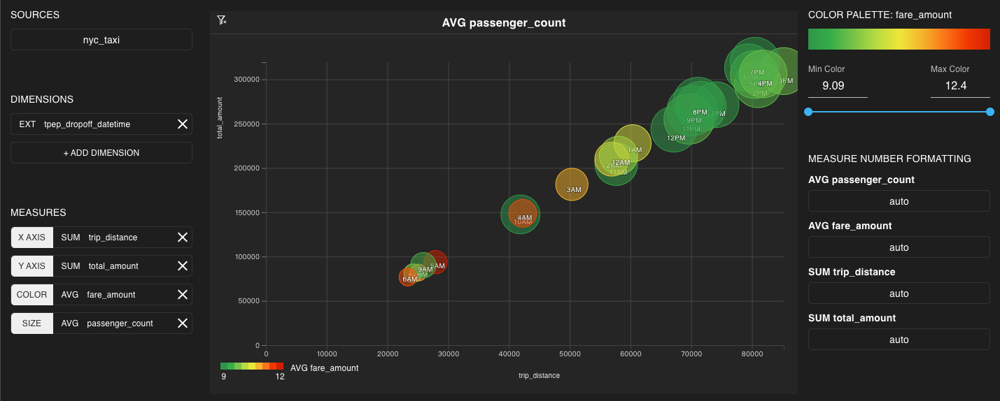

The following table displays parameters of a bubble chart:

| Parameter| Description |
|------|--------------|
|`SOURCES`  |   Table name in the database and used as the data source of the chart. This parameter is required.   |
|`DIMENSIONS`    |   Dimension field for the chart. Specifies how to group data. You can use column numbers of the data table or customized SQL queries as the parameter value. Refer to [Basic Data Operations](./megawise_basic_operation) for supported SQL syntax. This parameter is required. An example of customized expression is `tip_amount/total_amount`.  |
|`MEASURES`    |  Measure field for a chart. Specifies how to perform calculation on the data and includes the following parameters: <ul><li>`X AXIS`:Data of the Y AXIS. This parameter is required.</li><li>`Y AXIS`: Data of the Y AXIS. This parameter is required.</li><li>`COLOR`: Color of the bubbles.</li><li>`SIZE`: Size of the bubbles.</li></ul>  You can use built-in functions or customize SQL functions. Refer to [Functions and Operators](./megawise_func_op) for supported SQL functions. An example of customized expression is `avg(tip_amount/total_amount)`. |
|`COLOR PALETTE`    |     Color range of the bubbles.          |
|`MEASURE NUMBER FORMATTING` |  Display format of measure data in the chart.|

> Note: For charts with `DIMENSIONS`, you must use and only use [aggregate functions](./megawise_func_op) for customized expressions in `MEASURES`.

Click any bubble in the chart. If the bubble becomes highlighted, you can assume that the data represented by the bubble is added to the filter.

## Point map

In a point map, you can use the points to analyze the discrete distribution of data in the map. The following chart uses New York taxi data to display the differences of total fare amounts in different drop-off locations. The color of a point is determined by the proportion of the tips given by passengers that are dropped off. The more closer the color is to the maximum color, the higher the proportion of the tips. Refer to [Example datasets used in this topic](#Example-datasets-used-in-this-topic) for more information.

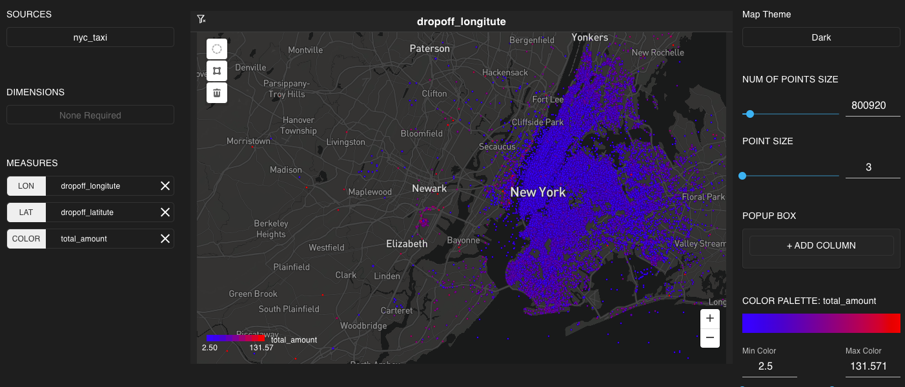

The following table displays parameters of a point map:

| Parameter| Description |
|------|--------------|
|`SOURCES`  |   Table name in the database and used as the data source of the chart. This parameter is required.   |
|`DIMENSIONS`    |   This parameter is not available for point maps.   |
|`MEASURES`    |   Measure field for a chart. Specifies how to perform calculation on the data and includes the following parameters: <ul><li>`LON`: Longitude of the data. This parameter is required.</li><li>`LAT`: Latitude of the data. This parameter is required.</li><li>`COLOR`: Color of the point.</li></ul> You can use built-in functions or customize SQL functions. Refer to [Functions and Operators](./megawise_func_op)  for supported SQL functions. An example of customized expression is `avg(tip_amount/total_amount)`.          |
|`Map Theme`  |  You can customize multiple map themes.           |
|`OF POINT SIZE`  |  The number of points in the map.            |
|`POINT SIZE`  |  The size of each point in the map.             |
|`POPUP BOX` |  Pop-up message that appears when the mouse hovers on a point in the map.             |
|`COLOR PALETTE`|     Color range of all points in the map.          |
|`MEASURE NUMBER FORMATTING` |  Display format of measure data in the chart.|

Use the following methods to set filters:

- Select the circle option and place a circle on the map. The area in the circle is included in the filter.
- Select the polygon option and place a polygon on the map. The area in the polygon is included in the filter.
- Select the zoom in/zoom out option. The area in the map is in the filter if there are no circles or polygons.

## Heat map

In a heat map, you can use the color regions to analyze the continuous distribution of data in the map. The following chart uses New York taxi data to display the differences of total fare amounts in different drop-off locations. The color of a region is determined by the total fare amount paid by passengers that are dropped off. The more closer the color is to the maximum color, the higher the total fare amount. Refer to [Example datasets used in this topic](#Example-datasets-used-in-this-topic) for more information.

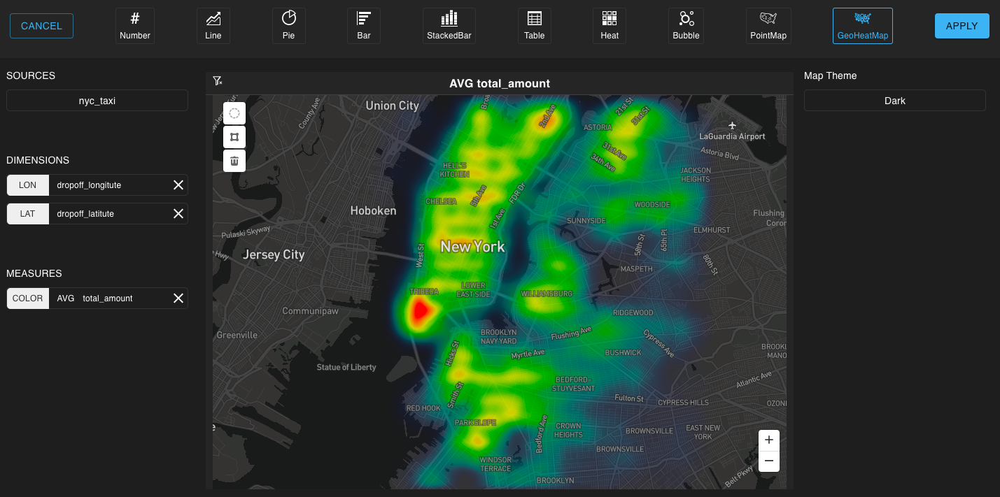

The following table displays parameters of a heat map:

| Parameter| Description |
|------|--------------|
|`SOURCES`  |   Table name in the database and used as the data source of the chart.    |
|`DIMENSIONS`    |   Dimension field for the chart. Specifies how to group data and includes the following parameters:<ul><li>`LON`: Longitude of the data. This parameter is required.</li><li>`LAT`: Latitude of the data. This parameter is required.</li></ul> You can use column numbers of the data table or customized SQL queries as the parameter value. Refer to [Basic Data Operations](./megawise_basic_operation) for supported SQL syntax. An example of customized expression is `tip_amount/total_amount`.   |
|`MEASURES`    |   Measure field for a chart. Specifies how to perform calculation on the data and includes the following parameters: <ul><li>`COLOR`：specifies the color area of the data. This parameter is required.</li></ul> You can use built-in functions or customize SQL functions. Refer to [Functions and Operators](./megawise_func_op) for supported SQL functions. An example of customized expression is `avg(tip_amount/total_amount)`.           |
|`Map Theme`  |  You can customize multiple map themes.           |

> Note: For charts with `DIMENSIONS`, you must use and only use [aggregate functions](./megawise_func_op) for customized expressions in `MEASURES`.

Use the following methods to set filters:

- Select the circle option and place a circle on the map. The area in the circle is included in the filter.
- Select the polygon option and place a polygon on the map. The area in the polygon is included in the filter.
- Select the zoom in/zoom out option. The area in the map is in the filter if there are no circles or polygons.
