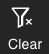

# Infini Overview

Infini, a visualized, interactive analytics interface, is built based on the React framework and the charts are developed based on the D3 library. You can freely configure each chart. Infini supports clustering and filtering for multiple columns of data. You can interact with multiple charts and update charts in real time via the exclusive crossfilter SQL functionality.

The Infini interface supports multiple types of charts. You can customize both the color and display format of charts.

## Dashboards

The Infini interface is composed of dashboards, which are in turn composed of charts. You can customize the layout of the charts in a dashboard.

## Charts

Charts are the smallest components of the Infini interface. Click the  button to configure parameters for a chart. Refer to [Chart Types and Parameter Reference](./chart_types) for more information about parameters for each chart type.

## Interact among charts in a dashboard

You can add filters to one or multiple charts to interact among charts. Refer to [Chart Types and Parameter Reference](./chart_types) for more information about adding filters to each chart type.

Click the  button in a chart to remove filters for the chart. Click the  button in a dashboard to remove filters for all charts in the dashboard.