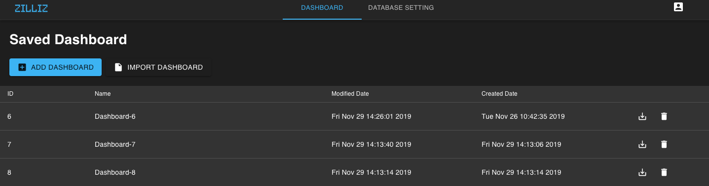

# Install Infini

<!-- TOC -->

- [Prerequisites](#Prerequisites)
- [Use Docker Compose to launch Infini](#Use-Docker-Compose-to-launch-Infini)
- [Visualized interface](#Visualized-interface)
- [Enter information for MegaWise](#Enter-information-for-MegaWise)
- [Stop Infini](#Stop-Infini)

<!-- /TOC -->

## Prerequisites

1. Make sure you have installed the following software:
   - [Docker 19.03 or higher](https://docs.docker.com/engine/installation/linux/docker-ce/ubuntu/)
   - [Docker Compose](https://docs.docker.com/compose/install/)
2. Make sure you have installed MegaWise, launched the MegaWise server and imported sample data.
   - [Install Megawise](https://www.zilliz.com/docs/install_megawise)

## Use Docker Compose to launch Infini

1. Make sure docker-compose is running:

   ```bash
   $ docker-compose --version
   ```

    If the terminal display the version of docker-compose, you can assume that docker-compose has been installed. The version of docker-compose is 1.24.1 in the following example:

    ```bash
    docker-compose version 1.24.1, build 4667896b
    ```

2. Download the config files to the same folder.

   ```bash
   $ wget https://raw.githubusercontent.com/Infini-Analytics/infini/master/config/webserver/.env \
   https://raw.githubusercontent.com/Infini-Analytics/infini/master/config/webserver/docker-compose.yml
   ```

3. Modify the `.env` file.

   > <font color='red'>Note：Update `192.168.1.60` to the IP address of the running Infini docker server. Update `192.168.1.106` to the IP address of the running MegaWise docker server.</font>

   ```yml
   # default API server address
   API_URL=http://192.168.1.60:9000
   # default web server port
   LOCAL_PORT=80
   # megawise IP address
   MEGAWISE_HOST=192.168.1.106
   # megawise username
   MEGAWISE_USER=zilliz
   # megawise password
   MEGAWISE_PWD=zilliz
   # megawise database
   MEGAWISE_DB=postgres
   # megawise port
   MEGAWISE_PORT=5433
   ```

4. Launch the Infini web server.

   ```shell
   # start Infini
   $ docker-compose -f docker-compose.yml up
   ```

5. Open `/etc/hosts` and add the following content:

   > <font color='red'>Note: Update `192.168.1.60` the IP address of the running Infini docker server. For Windows, the host file is in `C:\Windows\System32\drivers\etc\hosts`.</font>

   ```shell
    #/etc/hosts
    192.168.1.60 infini
   ```

6. Launch a browser. Chrome and Firefox are recommended.

   ```shell
   # Please add the port number if you modified the 80 port
   http://192.168.1.60
   ```


## Visualized interface

Now you can see the login page.


**Enter username and password to log in：**

- Default username: zilliz
- Default password: zilliz

## Enter information for MegaWise

After login, enter information for MegaWise. Save the information and jump to the dashboard page.




Click **New York Taxi Boards** to display the following page:


If you can see the previous page, you can assume that Infini is successfully installed.


## Stop Infini

```bash
# Stop Infini
$ docker-compose -f docker-compose.yml down
```
